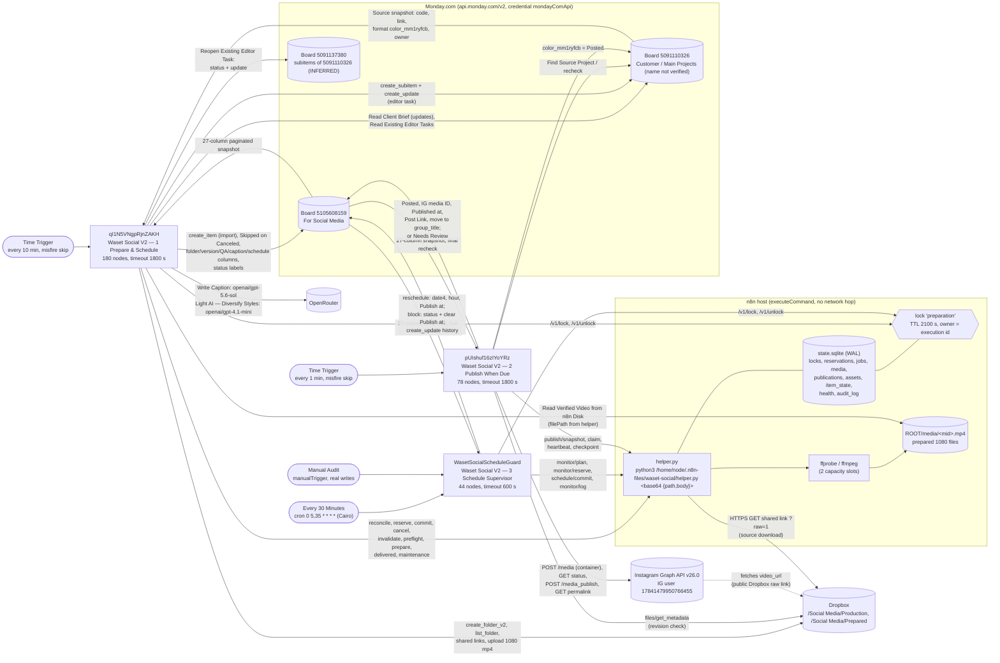

# 06 — Automation Dependency Graph

Part of **WASET SOCIAL MEDIA AUTOMATION — CURRENT SYSTEM TECHNICAL DOCUMENTATION**.

Scope: the three Waset Social V2 workflows on `https://n8n.wasetco.com`, the local helper `helper.py`, and the external systems they touch. Sources: the workflow exports in `workflow_exports/` (live definitions, read 2026-10-09), the local helper copy `helper_reference/helper.py` (657 lines, sha1 `57e158cb…`), and n8n execution records (2026-10-09, 14:00–16:01 UTC).

**Evidence labels**

| Label | Meaning |
|---|---|
| VERIFIED | Read directly in the workflow JSON (workflow ID + node name given). |
| DELEGATED-TO-HELPER (local copy) | Logic lives in `helper.py`. Line numbers refer to `helper_reference/helper.py`. That copy matches the bundle whose workflow JSON matches live node-for-node, but **the file deployed on the server at `/home/node/.n8n-files/waset-social/helper.py` has not been compared with it**. |
| INFERRED | Deduced from naming, wiring or data; not proven. |
| NOT IMPLEMENTED | Searched for and absent. |
| HISTORICAL OBSERVATION | Seen in execution records only; says nothing about the logic. |

---

## 1. Graph

Notes on the graph:
- There are **no edges between workflows**. No workflow calls another (see §2). All coupling goes through shared state: Monday columns, `state.sqlite`, and files.
- The `IG → Dropbox` edge is dashed because Instagram's servers fetch the `video_url`; n8n does not make that request (INFERRED from the Graph container model; the URL comes from the claim result, WF2 `Create Media Body`).
- Board 5091137380 is the board ID used in WF1 `Reopen Editor Plan` for the subitem status write. That it is the subitem board of 5091110326 is INFERRED.

---

## 2. Who triggers or calls whom

| Caller | Callee | Mechanism | Evidence | Label |
|---|---|---|---|---|
| Schedule, every 10 min, `misfirePolicy: skip` | WF1 `qI1N5VNgpRjnZAKH` | `Time Trigger` (scheduleTrigger 1.4) | WF1 `Time Trigger` | VERIFIED |
| Schedule, every 1 min, `misfirePolicy: skip` | WF2 `pUIshuf16zIYoYRz` | `Time Trigger` | WF2 `Time Trigger` | VERIFIED |
| Cron `0 5,35 * * * *` (Africa/Cairo), no misfirePolicy | WF3 `WasetSocialScheduleGuard` | `Every 30 Minutes` | WF3 `Every 30 Minutes` | VERIFIED |
| Human in the n8n editor | WF3 | `Manual Audit` (same path, **performs writes**) | WF3 `Manual Audit` | VERIFIED |
| WF1 | helper.py | 11 `executeCommand` nodes ("… — Local n8n") | WF1 node table | VERIFIED |
| WF2 | helper.py | 8 `executeCommand` nodes | WF2 node table | VERIFIED |
| WF3 | helper.py | 6 `executeCommand` nodes | WF3 node table | VERIFIED |
| helper.py | helper.py (detached child) | `subprocess.Popen(..., start_new_session=True)` for `/internal/media-job` and `/internal/preflight-job` | helper.py L337, L385, L645-652 | DELEGATED-TO-HELPER |
| Any workflow | Any other workflow | Execute Workflow node | Node-type count of all three exports: **zero** `executeWorkflow` nodes | VERIFIED (none) |
| External system | Any V2 workflow | Webhook | **zero** webhook nodes in the three exports | VERIFIED (none) |

`callerPolicy: workflowsFromSameOwner` is set on all three, but nothing calls them as sub-workflows (VERIFIED settings; no caller found among readable workflows).

### Run cadence and overlap

| Workflow | Cadence | Mutual exclusion | Label |
|---|---|---|---|
| WF1 | 10 min | `preparation` lock via `/v1/lock`; false branch of `Preparation Lock Acquired?` unconnected (run ends silently) | VERIFIED + DELEGATED-TO-HELPER (L450-456) |
| WF3 | :05 and :35 | Same `preparation` lock; false branch of `Supervisor Lock Acquired?` unconnected | VERIFIED |
| WF2 | 1 min | **No** `preparation` lock. Per-item publication lease (180 s) via `/v1/publish/claim` + `/v1/publish/heartbeat` | VERIFIED (wiring) + DELEGATED-TO-HELPER (`LEASE_SECONDS = 180`, L37; claim L531-564) |

---

## 3. Independent workflows

| Workflow | Independent of | Coupled to | Label |
|---|---|---|---|
| WF1 | No other workflow invokes it | WF3 through the `preparation` lock and `reservations` table; WF2 through Monday columns it writes and the `media` table / `/Social Media/Prepared` files | VERIFIED (no calls) / INFERRED (data coupling) |
| WF2 | Does not take the `preparation` lock; can run while WF1 or WF3 changes reservations | Reads WF1 outputs (Verified media ID, Publish video, Publish at, Processed format, Source asset version, Topazed); requires a **committed** reservation at claim | VERIFIED + DELEGATED-TO-HELPER (claim L537) |
| WF3 | No calls to WF1/WF2 | Shares lock with WF1; edits Scheduled items WF2 will publish; uses `/v1/schedule/commit` like WF1 | VERIFIED |

Each workflow can be deactivated alone without breaking a call chain. Deactivating WF1 stops new items being imported and scheduled. Deactivating WF2 stops all publishing. Deactivating WF3 stops schedule repair. (INFERRED from the absence of calls.)

---

## 4. Shared records (helper `state.sqlite`)

Location: `ROOT = $WASET_SOCIAL_DATA_DIR` or `~/.n8n-files/waset-social` (helper.py L29). Each endpoint runs in one `BEGIN IMMEDIATE` transaction (L449). All rows below are DELEGATED-TO-HELPER (local copy).

| Table | Written by (endpoint → workflow node) | Read by | Purpose |
|---|---|---|---|
| `locks` | `/v1/lock`, `/v1/unlock` → WF1 and WF3 "Acquire/Release Preparation Lock" | same | Global `preparation` lock, TTL 2100 s (L455) |
| `reservations` | `/v1/schedule/reserve` (WF1 `Reserve Style Slot`), `/v1/schedule/commit` (WF1 `Commit Slot`, WF3 `Commit Repaired Slot`), `/v1/schedule/cancel` (WF1 `Cancel Reserved Slot`), `/v1/schedule/reconcile` (WF1 `Reconcile Reserved Slots`), `/v1/item/invalidate` (WF1 `Invalidate Changed Content`), `/v1/monitor/reserve` (WF3 `Reserve Corrected Slot`) | `/v1/publish/claim` (WF2), `/v1/monitor/plan` (WF3) | Slot booking; `UNIQUE(format, at)` |
| `jobs` | detached `/internal/media-job`, `/internal/preflight-job` | `/v1/media/prepare`, `/v1/media/preflight` (WF1) | Async ffprobe/ffmpeg results, retry/backoff |
| `media` | `prepare_media` child; `/v1/media/delivered` (WF1 `Register Verified Delivery`) adds `metadata.url` | claim (WF2), monitor plan/reserve (WF3), invalidate (WF1) | Verified 1080 file per item/asset |
| `item_state` | `/v1/item/invalidate` (WF1) | same | Last seen format + asset per item |
| `publications` | `/v1/publish/claim`, `/v1/publish/checkpoint` (WF2) | `/v1/publish/snapshot` (WF2 `Publication Receipts`), monitor plan (WF3), invalidate (WF1), maintenance (WF1) | Publish receipt + lease, stages `claimed → container_created → publish_requested → published → source_synced` |
| `assets` | `/v1/publish/claim` (WF2) | same | Duplicate-asset guard `account\|format\|contentHash` |
| `audit_log` | invalidate (`content_changed`), monitor/reserve (`monitor_reserved`), monitor/log (`monitor_applied`, WF3 `Audit Repair`) | nobody (no workflow reads it) | Partial audit trail |
| `health` | every endpoint (L630-636) | `/v1/health` — **no caller** | Last result per endpoint |

---

## 5. Shared Monday columns (board 5105608159)

Writers listed by workflow and node. All VERIFIED from the exports unless marked.

| Column (ID) | WF1 writes | WF2 writes | WF3 writes | Read by |
|---|---|---|---|---|
| Status (`status`) | `Apply Source Sync` (create / Skipped), `Save Early Warning`, `Save Accepted Duration`, `Save QA Result`, `Save Schedule`, `Save Item Note` | `Mark Posted in Monday` (Posted), `Save Publication Note` (Needs Review) | `Save Schedule Repair` (block: helper-chosen label) | all three |
| Post Date (`date4`), Post Time (`hour_mm7xy9cf`) | `Save Schedule`; cleared on format change (`Save Selected Version`) | — | `Save Schedule Repair` (reschedule) | all three (`at()` fallback) |
| Publish at (`date_mm7y8s9t`, read as UTC) | `Save Schedule`; cleared by several notes | — | reschedule sets / block clears | all three (primary `at()`) |
| المطلوب منك (`long_text_mm7zbtbn`) | several | `Save Publication Note` (only if empty) | reschedule clears / block sets | WF2 guard, WF3 snapshot |
| System update (`long_text_mm7ysrbz`) | several | `Mark Posted`, `Save Publication Note` | `Save Schedule Repair` | — |
| Format (`color_mm7xm9b6`) | set at creation only | — | — | all three (guards) |
| Processed format (`text_mm7z139h`) | `Save Selected Version` | — | — | WF2 `Publication Context`, WF3 snapshot |
| Topazed (`color_mm7xe2j2`) | `Save Selected Version` (from run-start snapshot) | — | — | WF2 claim + final gate; WF3 snapshot |
| Source asset version (`text_mm7yy451`) | `Save Selected Version` | — | — | WF2 revision check; WF3 guard |
| Verified media ID (`text_mm7yp8h`) | `Save QA Result`; cleared by notes | — | — | WF2, WF3 |
| Publish video (`link_mm7ywc0w`) | `Save QA Result` | — | — | WF2 `expectedUrl`, WF3 snapshot |
| Post Link (`link_mm7xb56a`) | — | `Mark Posted in Monday` | — | all three as "already posted" guard |
| Instagram media ID (`text_mm7yfqhb`), Published at (`date_mm7yr4h3`) | — | `Mark Posted in Monday` | — | — |
| Caption (`long_text_mm7x2ay1`) | `Save Caption` (LLM) | — | — | WF2 (`Create Media Body`, final gate) |
| Story variety (`text_mm7yjmqd`) | `Save Selected Version` (overwrites) | — | — | WF1/WF3 `rotation()` |
| Last checked (`date_mm7zd2b9`) | several | never | never | WF1 queue ordering |
| Group | create into `topics` (Post) / `group_mm7xagm` (Story) | `move_item_to_group` → `group_title` (Posted) | none | — |

Other boards:
- **5091110326:** WF1 reads (source snapshot, client brief, subitems) and creates subitems; WF2 reads (source project) and writes `color_mm1ryfcb = Posted` (`Sync Posted to Customer Projects`). VERIFIED.
- **5091137380:** WF1 `Reopen Existing Editor Task` writes `status` + update. Identity as subitem board INFERRED.
- Board 5091110326 is also written by several non-social workflows (see §7 note). Whether any of them writes `color_mm1ryfcb` is not verified.

---

## 6. Ownership of functions

| Function | Owner | Evidence | Label |
|---|---|---|---|
| Importing items into 5105608159 | WF1 `Build Sync Mutations` / `Apply Source Sync` (from 5091110326, unique Code, format Post/Story/Canceled). Whether anything else also creates items is unknown. | WF1 | VERIFIED (WF1 path) / unverified (other sources) |
| Media preparation (download, probe, transcode, QA) | helper.py child jobs, started by WF1 | helper.py L180-263, L303-388 | DELEGATED-TO-HELPER |
| Slot grid, diversity, starvation fallback | helper.py `next_slot` / `slots` (`REELS`, `STORIES` L32-33) | helper.py L99-125 | DELEGATED-TO-HELPER |
| Scheduling (writing a time + Scheduled) | WF1 `Save Schedule` → `Commit Slot` | WF1 | VERIFIED |
| Schedule repair | WF3 (plan from `/v1/monitor/plan`) | WF3 | VERIFIED + DELEGATED-TO-HELPER |
| Publishing to Instagram | WF2 only (`Create Container`, `Publish To Instagram`) | WF2 | VERIFIED |
| Facebook Page publishing | none | no FB Page endpoints in any export | NOT IMPLEMENTED |
| Monitoring / health | WF3 supervises the schedule only. `/v1/health` exists but no workflow calls it. No error workflow. | WF3; helper.py L599-601; settings | VERIFIED |
| Notifications to humans | Only Monday writes (status, المطلوب منك, System update, item Updates, editor subitem updates). **No notification workflow exists**; no Slack, email or Telegram node in V2. | node-type counts of the three exports | VERIFIED |
| Error alerting | none (`errorWorkflow` absent in all three) | settings | VERIFIED |
| Editor tasks | WF1 (subitem on the source project) | WF1 `Create Assigned Editor Task` | VERIFIED |
| Caption writing | WF1 LLM `Write Caption` | WF1 | VERIFIED |

---

## 7. Note on other workflows

The instance has 28 workflows (`02_WORKFLOW_INVENTORY.md`). Ten readable non-social workflows were checked and **none references board 5105608159**; several write board 5091110326, which WF1 and WF2 read (for example `DGluKvTQrYDLXZTg` writes `project_status`, `pFb16xMOaY6aBPBv` writes `priority_1`). No dependency between them and the V2 system was found, and none is drawn above.

**15 workflows are not accessible via MCP and were not reviewed** (inventory section C, e.g. `7D6DDdNoLDw3syFM` "When a Stat Changes In Main Projects (Office)", `oR268O5OPIb0y0T0` "Final Link Update (Office)"). They may create items on 5105608159 or write the source columns WF1 reads (`color_mm1ryfcb`, `link_mm06bswn`). This graph cannot rule that out, and it does not show them as dependencies.
